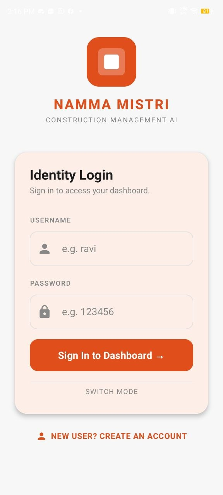
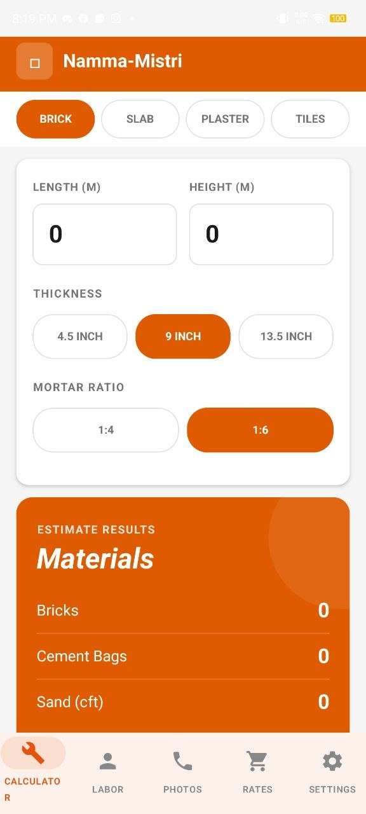
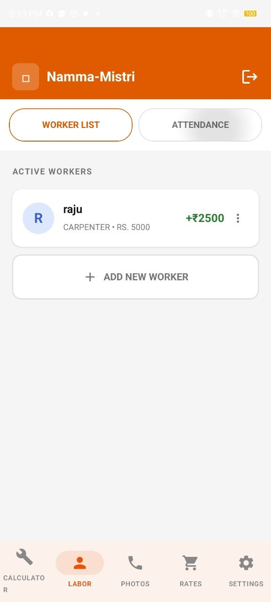
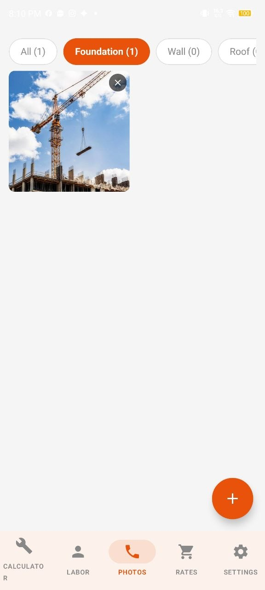
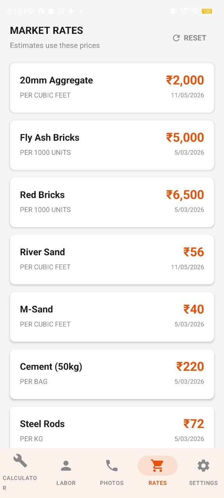
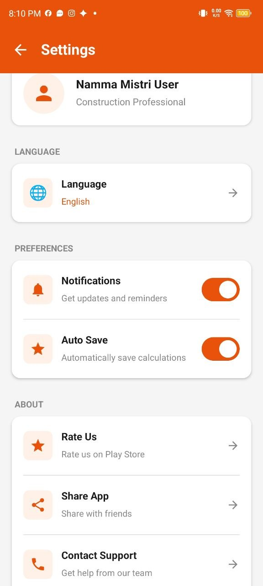

# Namma Mistri Self Employment App

An Android application developed using **Kotlin** and **Jetpack Compose** to support self-employed workers and small businesses in managing daily activities digitally.

## 📱 Features

- Member Management
- Savings Tracking
- Loan Tracking
- User-Friendly Dashboard
- Modern UI using Jetpack Compose
- Local Data Storage using Room Database

## 🛠️ Technologies Used

- Kotlin
- Android Studio
- Jetpack Compose
- Room Database
- Material Design

## 📂 Project Structure

```plaintext
app/
gradle/
build.gradle.kts
settings.gradle.kts
```

## 🚀 How to Run the Project

1. Clone the repository
2. Open the project in Android Studio
3. Sync Gradle files
4. Run the application on Emulator or Android device

## 👨‍💻 Developed By

Pranathi

## 📌 Project Objective

The objective of this project is to simplify self-employment and local worker management through a digital Android application that helps users maintain records efficiently.

## 📷 Screenshots

### 🔐 Login Screen


### 🧮 Calculation Screen


### 👷 Labor Management Screen


### 📸 Photos Screen


### 💰 Rate Screen


### ⚙️ Settings Screen


---

⭐ Developed as part of Android App Development using GenAI Project.
